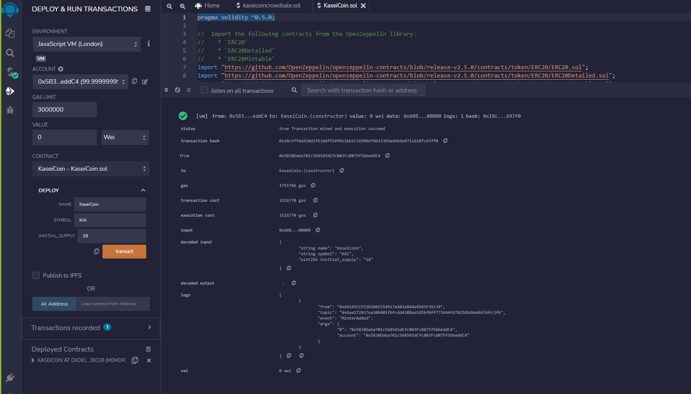
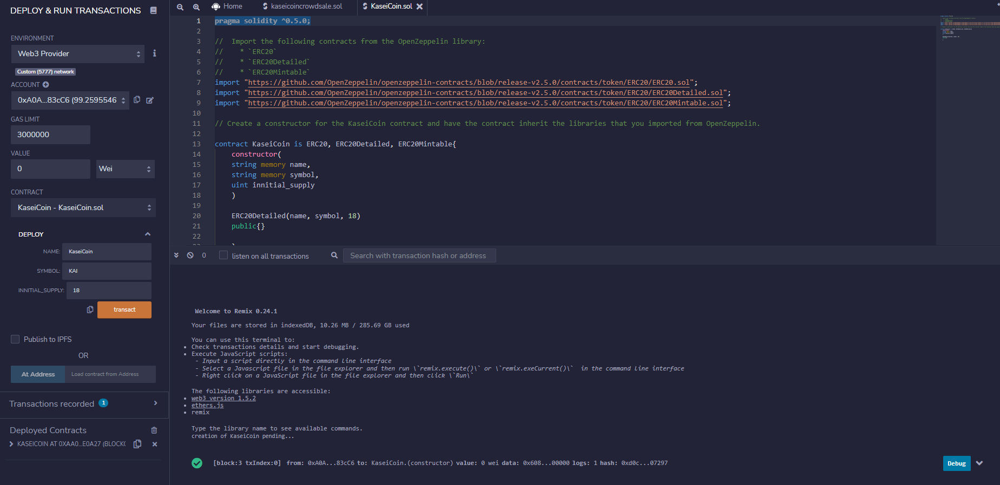
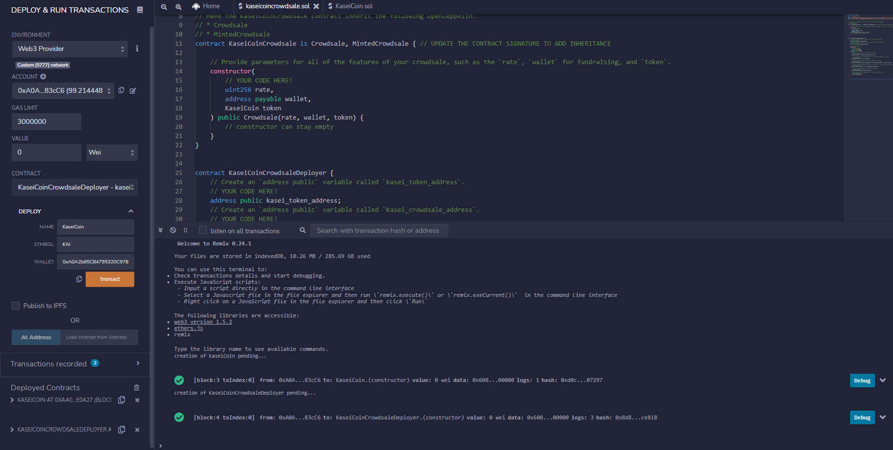
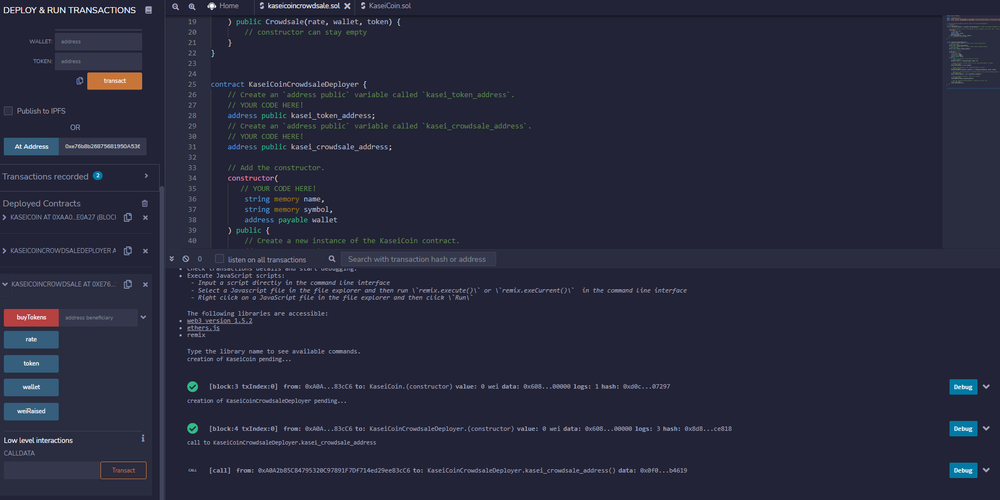
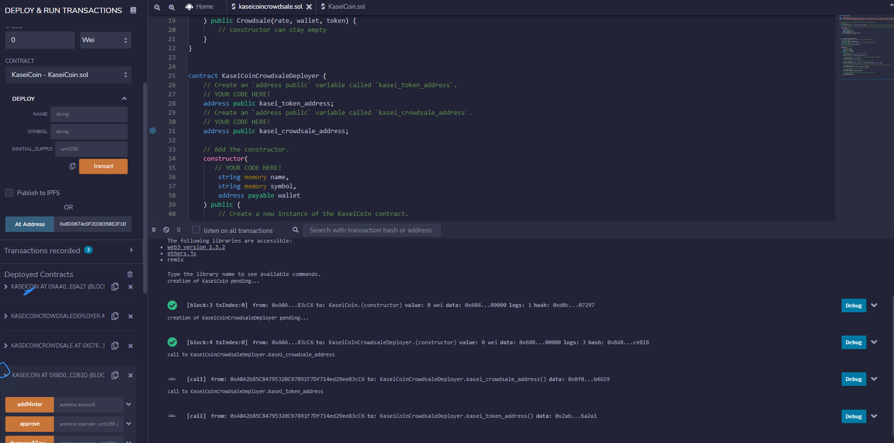
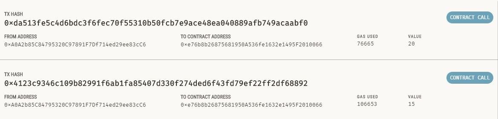
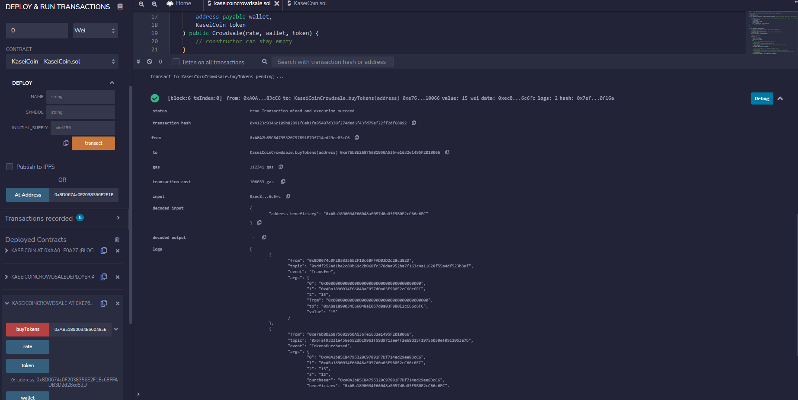
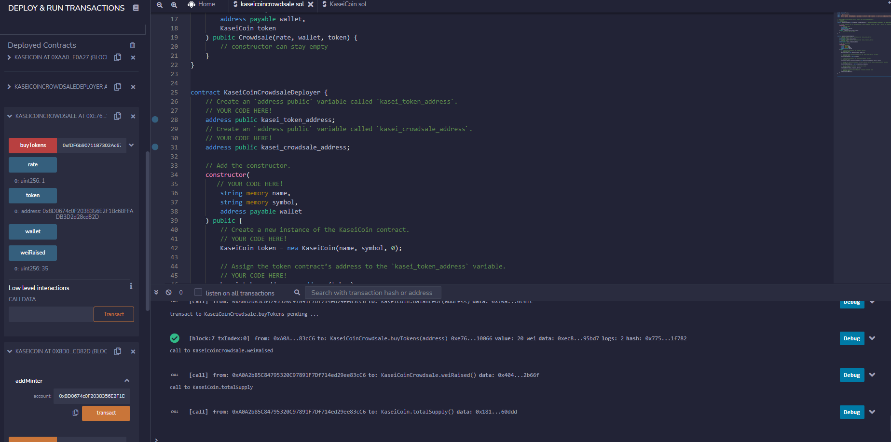
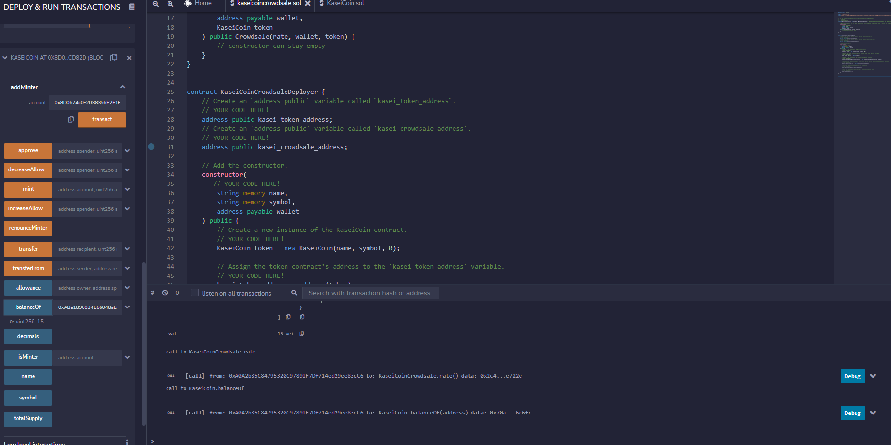

# advanced-solidity-homework
UofT Fintech Week 21

1. Create a Joint Savings Account Contract in Solidity

2. Compile and Deploy Your Contract in the JavaScript VM

3. Interact with Your Deployed Smart Contract

